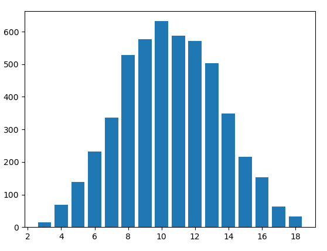

## This tool simulates dice rolls and outputs the results to a bar graph

This simulator's main purpose is to simulate many dice rolls. For example, I could run 5000 trials of rolling 3 6-sided dice.



This tool must be run from a command line. From my own testing this will not work in VScode.

Make sure you have numpy and matplotlib installed. You can run the code below to install them and their dependencies
```
pip install requirements.txt
```